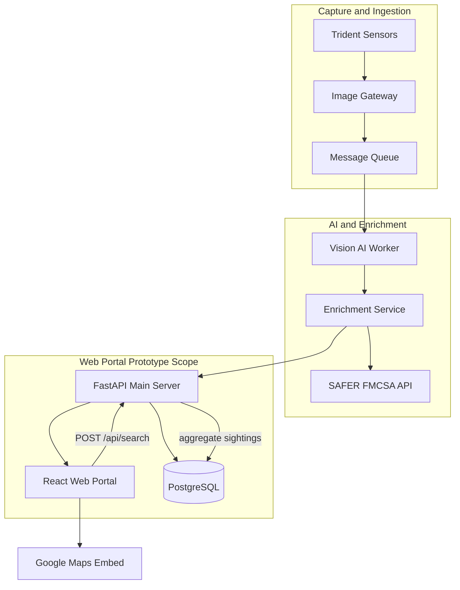

# GenLogs Platform — Architecture

## Module Flow

## Prototype Scope

This prototype implements the **User Query → Data Retrieval → Display** path. Ingestion, Vision AI, and live FMCSA calls are simulated via seeded PostgreSQL data.

## Components

| Component | Role |
|-----------|------|
| React Web Portal | City search UI, route maps, carrier list |
| FastAPI Main Server | Search API, health check, static file serving |
| PostgreSQL | Stores carriers, vehicles, sightings |
| Google Maps Embed | Displays top 3 route options |
