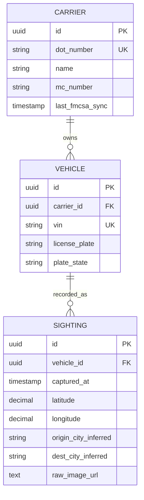

# GenLogs Platform — Database Design

## ER Diagram

## Tables

### carriers

| Column | Type | Constraints | Description |
|--------|------|-------------|-------------|
| id | UUID | PK | Unique internal identifier |
| dot_number | VARCHAR(255) | UNIQUE, NOT NULL | USDOT number |
| name | VARCHAR(255) | NOT NULL | Legal carrier name |
| mc_number | VARCHAR(255) | nullable | Motor Carrier identifier |
| last_fmcsa_sync | TIMESTAMPTZ | nullable | Last SAFER API sync |

### vehicles

| Column | Type | Constraints | Description |
|--------|------|-------------|-------------|
| id | UUID | PK | Unique internal identifier |
| carrier_id | UUID | FK → carriers.id | Links to carrier |
| vin | VARCHAR(17) | UNIQUE, NOT NULL | Vehicle Identification Number |
| license_plate | VARCHAR(20) | nullable | Detected plate number |
| plate_state | VARCHAR(2) | nullable | US state code |

### sightings

| Column | Type | Constraints | Description |
|--------|------|-------------|-------------|
| id | UUID | PK | Unique internal identifier |
| vehicle_id | UUID | FK → vehicles.id | Links to vehicle |
| captured_at | TIMESTAMPTZ | NOT NULL | Camera capture time |
| latitude | DECIMAL(9,6) | NOT NULL | GPS latitude |
| longitude | DECIMAL(9,6) | NOT NULL | GPS longitude |
| origin_city_inferred | VARCHAR(255) | nullable | Calculated origin city |
| dest_city_inferred | VARCHAR(255) | nullable | Calculated destination city |
| raw_image_url | TEXT | nullable | S3/cloud storage link |

## Indexes

- `carriers_dot_number_idx` on carriers(dot_number)
- `sightings_origin_city_inferred_idx` on sightings(origin_city_inferred)
- `sightings_dest_city_inferred_idx` on sightings(dest_city_inferred)

## Relationships

| Type | Source | Target | FK |
|------|--------|--------|-----|
| One-to-Many | Carrier | Vehicle | vehicle.carrier_id |
| One-to-Many | Vehicle | Sighting | sighting.vehicle_id |
